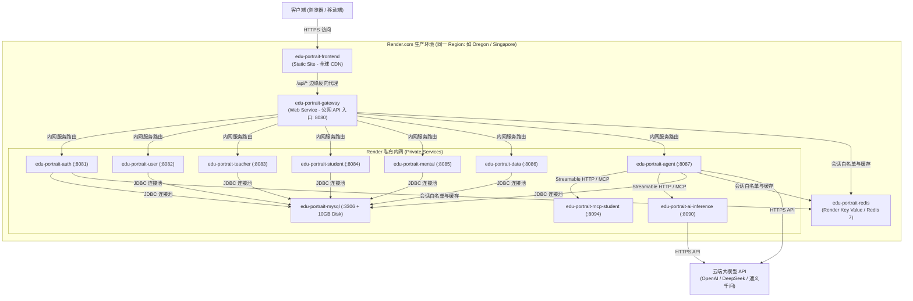

# Render.com 生产环境完整部署指南

本文档提供**师生资源画像系统（EduCare Portrait System）**在 [Render.com](https://render.com) 云平台上的完整生产环境部署流程、架构说明与运维排错规范。

---

## 目录
- [1. 架构与拓扑](#1-架构与拓扑)
- [2. 部署前准备](#2-部署前准备)
- [3. 一键 Blueprint 部署流程](#3-一键-blueprint-部署流程)
- [4. 数据库初始化 (MySQL 8.0)](#4-数据库初始化-mysql-80)
- [5. 环境变量与安全密钥配置](#5-环境变量与安全密钥配置)
- [6. 大模型与 AI 推理配置 (LLM / RAG)](#6-大模型与-ai-推理配置-llm--rag)
- [7. 前端 CDN 与接口反代](#7-前端-cdn-与接口反代)
- [8. 自定义域名与 SSL/TLS 证书](#8-自定义域名与-ssltls-证书)
- [9. 生产环境运维与排错](#9-生产环境运维与排错)

---

## 1. 架构与拓扑

系统在 Render 上的生产拓扑严格遵循**纵深防御**与**最小权限原则**：



- **公网入口**：仅前端静态站点（`edu-portrait-frontend`）与后端网关（`edu-portrait-gateway`）对公网开放。
- **业务微服务**：Auth/User/Teacher/Student/Mental/Data/Agent/MCP 均作为 **Private Services (`type: pserv`)**，仅内网可见，杜绝外网未授权直连。
- **持久化数据**：MySQL 8.0 挂载 10GB Render 高性能持久化磁盘；Redis 采用 Render Key Value 托管实例。

---

## 2. 部署前准备

1. **Git 仓库**：确保本系统代码已推送到 GitHub / GitLab 私有或公开仓库。
2. **Render 账号**：登录 [Render.com](https://dashboard.render.com/)。
3. **大模型 API Key**：准备好 OpenAI API Key、DeepSeek API Key 或通义千问 API Key。

---

## 3. 一键 Blueprint 部署流程

本系统已在根目录预置经过严格测试的 `render.yaml` Blueprint 基础设施代码。

1. 进入 [Render 控制台](https://dashboard.render.com/)。
2. 点击右上角 **New +** 按钮，选择 **Blueprint**。
3. 连接您的 Git 仓库，Render 会自动识别根目录的 `render.yaml`。
4. 在 Blueprint 配置确认界面：
   - 填写 Blueprint 实例名称（如 `edu-portrait-prod`）。
   - 选择部署区域 **Region**（建议选择与大模型 API 最接近的区域，如 `Oregon (US West)` 或 `Singapore`）。
   - 按提示输入 `LLM_API_KEY`（大模型 API 密钥）。
5. 点击 **Apply**，Render 将自动创建并编排所有服务群与数据存储。

---

## 4. 数据库初始化 (MySQL 8.0)

在初次部署时，需要导入系统数据库表结构与默认种子数据：

### 方式 A：通过 Render MySQL 容器内置 Web Shell 初始化（推荐）
1. 在 Render Dashboard 中打开 `edu-portrait-mysql` 服务。
2. 点击顶部的 **Shell** 选项卡进入容器终端。
3. 执行以下命令导入初始化脚本（脚本已在构建时置入或可通过 curl / 复制导入）：
   ```bash
   mysql -u edu -pedu123456 edu_portrait
   ```
4. 将项目中的 `sql/init/01_init.sql` 内容粘贴执行，或在本地连接云数据库执行。

### 方式 B：使用外部云 MySQL 托管（如 Aiven, TiDB Cloud, AWS RDS, Railway）
如果您使用外部云数据库：
1. 在外部数据库上新建数据库 `edu_portrait`，导入 `sql/init/01_init.sql`。
2. 在 Render Dashboard 中的 `edu-portrait-common-env` 环境变量组中，将 `MYSQL_HOST`、`MYSQL_PORT`、`MYSQL_USER`、`MYSQL_PASSWORD` 改为您的云数据库连接信息。

**默认预置账号（密码均为用户名）：**
| 用户名 | 角色 | 默认密码 | 说明 |
| :--- | :--- | :--- | :--- |
| `admin` | 管理员 | `admin` | 系统全权限管理 |
| `teacher` | 教师 | `teacher` | 教师画像与课程查看 |
| `student` | 学生 | `student` | 学生画像与测评查看 |

---

## 5. 环境变量与安全密钥配置

所有公共环境变量均由 `render.yaml` 中的 `edu-portrait-common-env` 统一管控：

| 环境变量名 | 描述 | 默认值 / 推荐配置 |
| :--- | :--- | :--- |
| `SPRING_PROFILES_ACTIVE` | Spring Boot 运行环境 | `prod` |
| `JWT_SECRET` | 用户会话签名密钥 | Render 自动生成 256 位随机字符串 |
| `EDUCARE_MCP_TOKEN` | MCP 节点内部鉴权 Token | Render 自动生成 256 位随机字符串 |
| `MYSQL_HOST` | MySQL 数据库主机 | `edu-portrait-mysql` (或云主机域名) |
| `MYSQL_PORT` | MySQL 端口 | `3306` |
| `MYSQL_DATABASE` | 数据库名 | `edu_portrait` |
| `MYSQL_USER` | 数据库用户名 | `edu` |
| `MYSQL_PASSWORD` | 数据库密码 | `edu123456` |
| `REDIS_HOST` | Redis 主机 | 自动绑定 `edu-portrait-redis` |
| `REDIS_PORT` | Redis 端口 | `6379` |
| `LLM_BASE_URL` | 大模型 API 端点 | `https://api.openai.com/v1` 或 DeepSeek 端点 |
| `LLM_API_KEY` | 大模型 API 密钥 | `sk-xxxxxx` |
| `LLM_MODEL` | 推理模型名称 | `qwen2.5-14b` / `gpt-4o-mini` / `deepseek-chat` |

---

## 6. 大模型与 AI 推理配置 (LLM / RAG)

### 支持的云端模型商配置示例：

- **DeepSeek API**：
  - `LLM_BASE_URL`: `https://api.deepseek.com/v1`
  - `LLM_MODEL`: `deepseek-chat`
  - `LLM_API_KEY`: 您的 DeepSeek API Key

- **阿里云通义千问 (DashScope OpenAI 兼容接口)**：
  - `LLM_BASE_URL`: `https://dashscope.aliyuncs.com/compatible-mode/v1`
  - `LLM_MODEL`: `qwen-plus` 或 `qwen2.5-72b-instruct`
  - `LLM_API_KEY`: 您的 DashScope API Key

- **OpenAI 官方**：
  - `LLM_BASE_URL`: `https://api.openai.com/v1`
  - `LLM_MODEL`: `gpt-4o-mini`
  - `LLM_API_KEY`: 您的 OpenAI API Key

---

## 7. 前端 CDN 与接口反代

`edu-portrait-frontend` 部署为 Render Static Site，具备以下生产特性：
1. **全球 CDN 加速**：静态资源（JS/CSS/图片）全球边缘节点缓存（`Cache-Control: public, max-age=31536000, immutable`）。
2. **SPA 路由兜底**：`/* -> /index.html`，刷新页面不报 404。
3. **API 边缘反代**：将 `/api/*` 请求无缝反向代理至 `edu-portrait-gateway`。
   - *提示*：在首次部署后，可在 `render.yaml` 中将 destination 确认更新为 Render 实际分配给您的网关域名（如 `https://edu-portrait-gateway.onrender.com/*`）。

---

## 8. 自定义域名与 SSL/TLS 证书

1. 在 Render Dashboard 中进入 `edu-portrait-frontend`（或 `edu-portrait-gateway`）。
2. 点击 **Settings -> Custom Domains**。
3. 添加您的自定义域名（例如 `portrait.yourdomain.com`）。
4. 按照提示在您的 DNS 服务商（如 Cloudflare, 阿里云 DNS, DNSPod）添加一条 `CNAME` 解析记录指向 Render 提供的地址。
5. Render 将自动申请并续签免费的 Let's Encrypt SSL/TLS 证书（全站 HTTPS）。

---

## 9. 生产环境运维与排错

### 1. 探活检查 (Health Checks)
- 网关与各微服务已配置 Spring Boot Actuator 端点：
  - 网关健康状态：`GET https://<gateway-domain>/actuator/health`
  - 返回 `{"status":"UP"}` 即表示网关与下游服务正常。

### 2. 内存优化 (JVM cgroups v2 适配)
- 所有 Spring Boot 容器均已配置 `-XX:MaxRAMPercentage=75.0 -XX:+UseG1GC`，动态适应 Render 容器内存分配，避免触发 OOM 杀进程。

### 3. 日志排查
- 在 Render Dashboard 中点击任意服务进入 **Logs** 选项卡，可实时查看容器输出日志。
- 若服务无法启动，优先检查：
  1. `edu-portrait-mysql` 是否已就绪并完成建表。
  2. `edu-portrait-redis` 是否正常连接。
  3. `JWT_SECRET` 是否已注入且不为空。

---

*部署遇到任何问题，可随时参考官方文档 [Render Blueprint Reference](https://render.com/docs/blueprint-spec)。*
